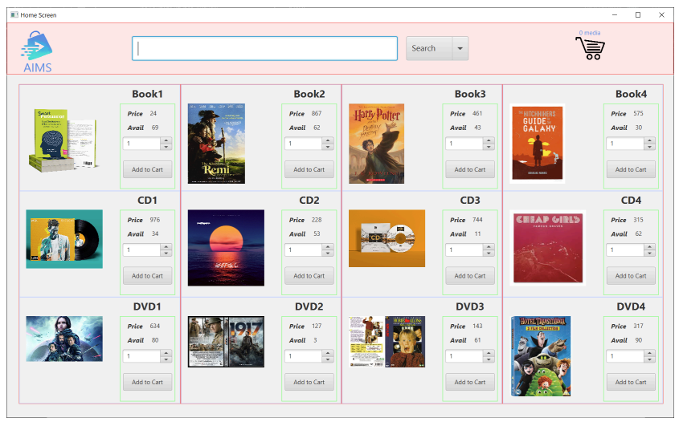
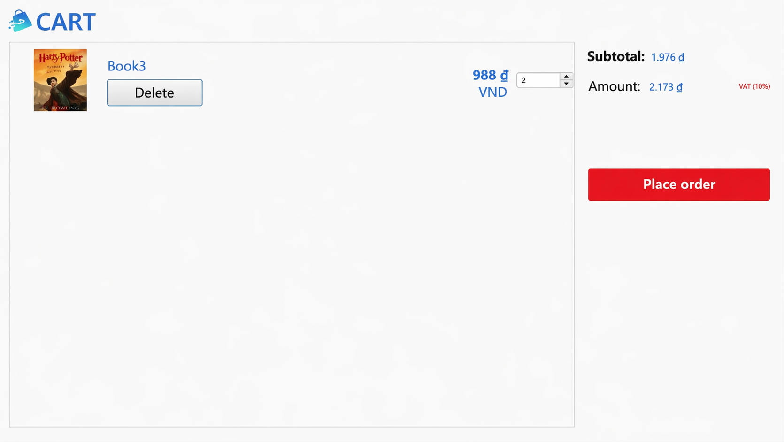
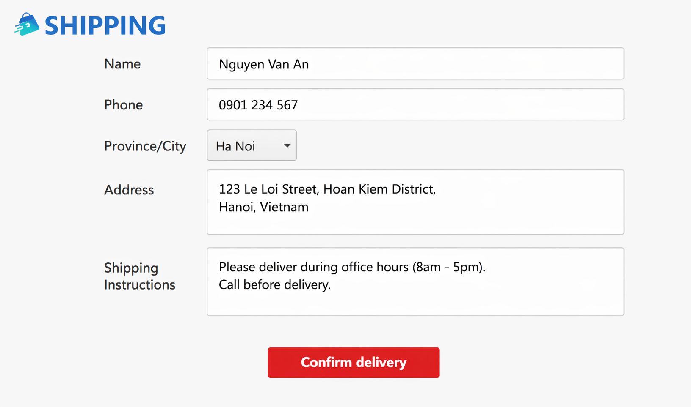
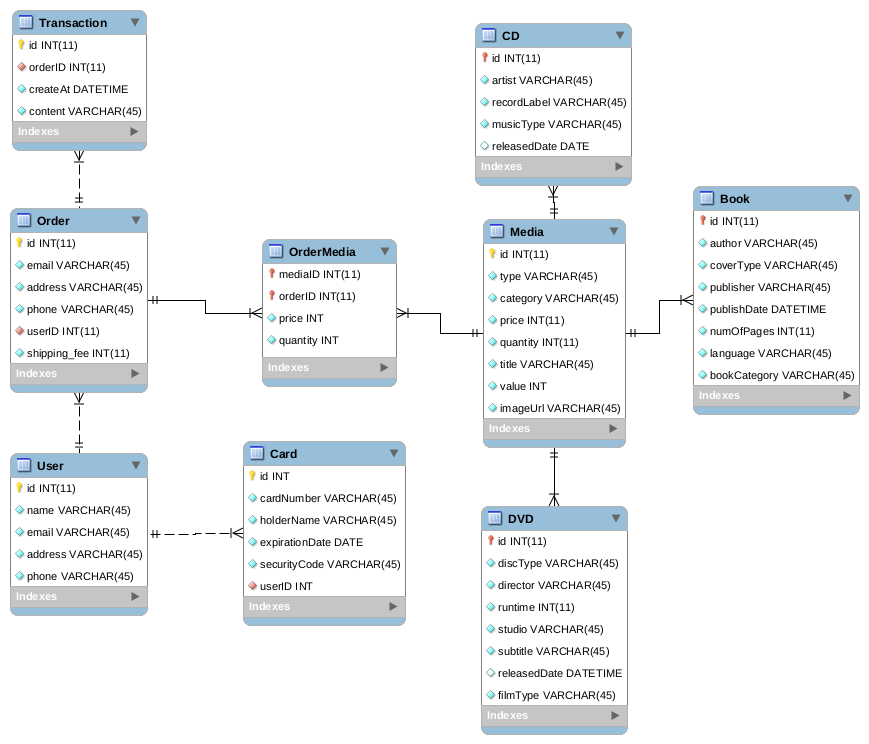
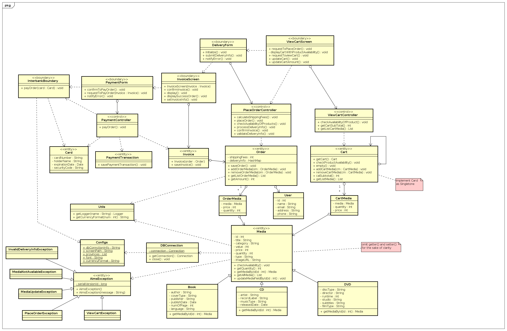

# AIMS — An Internet Media Store

> A desktop application for browsing and purchasing media products (Books, CDs, DVDs) built with Java and JavaFX.

---

## Screenshots

| Home Page | Cart / Place Order | Shipping Form |
|:---------:|:-----------------:|:-------------:|
|  |  |  |

---

## System Design

### Database Design



### Class Diagram



---

## Features

- Browse a catalog of media products: **Books**, **CDs**, and **DVDs**
- Add items to a shopping cart and manage quantities
- Place orders with delivery information
- Process payments via an interbank payment subsystem (credit card)
- View order invoices and transaction history
- Persistent data storage with **SQLite**

---

## Tech Stack

| Layer | Technology |
|---|---|
| Language | Java 11+ |
| UI Framework | JavaFX 15 |
| Database | SQLite (`sqlite-jdbc`) |
| Testing | JUnit 5 |
| IDE | Eclipse |

---

## Project Structure

```
AIMS-Student/
├── src/
│   ├── App.java                  # Application entry point
│   ├── common/exception/         # Custom exception classes
│   ├── controller/               # Business logic controllers
│   ├── entity/                   # Domain models (Cart, Media, Order, Payment, …)
│   ├── subsystem/                # Interbank payment subsystem
│   ├── utils/                    # Utility classes & configuration
│   └── views/                    # JavaFX FXML layouts & screen handlers
├── test/                         # Unit tests
├── lib/
│   ├── linux/javafx-sdk-15/      # JavaFX SDK for Linux
│   └── win/javafx-sdk-15/        # JavaFX SDK for Windows
└── assets/
    ├── db/                       # SQLite schema & MySQL Workbench file
    └── images/                   # Product and UI images
```

---

## Design Patterns

| Pattern | Where applied | Purpose |
|---|---|---|
| **Singleton** | `Cart`, `AIMSDB` | Ensure a single shared instance of the cart and database connection across the app |
| **MVC** | `entity/` · `controller/` · `views/` | Cleanly separate domain data, business logic, and UI rendering |
| **Facade** | `InterbankSubsystem` | Expose a simple payment API that hides the internal `InterbankSubsystemController` complexity |
| **Template Method** | `BaseController` → controllers · `BaseScreenHandler` → screens | Define a common skeleton and let subclasses specialise behaviour |
| **Strategy (Interface)** | `InterbankInterface` | Decouple payment logic from a concrete implementation so the subsystem can be swapped or mocked |
| **Inheritance / Polymorphism** | `Media` → `Book`, `CD`, `DVD` | Share common media attributes while allowing each type to carry its own fields |

---

## Getting Started

> [!NOTE]
> **Prerequisites** — make sure you have all of the following before continuing:
> - **Java 11** or higher
> - **Eclipse IDE** (recommended)
> - **JavaFX 15** (bundled under `lib/`)

---

### Step 1 — Clone the repository

```bash
git clone https://github.com/leminhnguyen/AIMS-Student.git
cd AIMS-Student
```

---

### Step 2 — Open in Eclipse

> [!TIP]
> Go to **Eclipse** → **File** → **Open Projects from File System…** and select the cloned root directory.

---

### Step 3 — Configure dependencies

> [!IMPORTANT]
> You need to add three libraries to the build path.

**SQLite JDBC**

```
Project → Properties → Java Build Path → Classpath → Add JARs…
Select sqlite-jdbc-3.7.2.jar from the lib/ directory.
```

**JUnit 5**

```
Project → Properties → Java Build Path → Modulepath → Add Library… → JUnit → Next
```

**JavaFX**

```
Eclipse → Window → Preferences → Java → Build Path → User Libraries → New
Name it (e.g. JavaFX15) and add all JARs from:
  • Linux  : lib/linux/javafx-sdk-15/lib/
  • Windows: lib/win/javafx-sdk-15/lib/
Then add the user library to the project classpath.
```

---

### Step 4 — Add VM arguments

> [!IMPORTANT]
> Open **Run** → **Run Configurations…** → **Java Application**, select your launch config, and paste the VM arguments below.

**Linux**
```
--module-path lib/linux/javafx-sdk-15/lib --add-modules javafx.controls,javafx.fxml
```

**Windows**
```
--module-path lib/win/javafx-sdk-15/lib --add-modules javafx.controls,javafx.fxml
```

---

### Step 5 — Set up the database

> [!TIP]
> Import the SQL schema into SQLite using the file at `assets/db/aims_sqlite.sql`.

---

## Running Tests

> [!NOTE]
> Tests are located in the `test/` directory and use **JUnit 5**.  
> Run them from Eclipse via **Run As** → **JUnit Test**.

---

## Authors

| Name | Role | Batch |
|---|---|---|
| nguyenlm | Software Engineering Student | K61 |
| manhvd | Software Engineering Student | K61 |
| hieudm | ICT Student | K61 |

---

## License

This project is intended for educational purposes as part of the Software Engineering curriculum.
